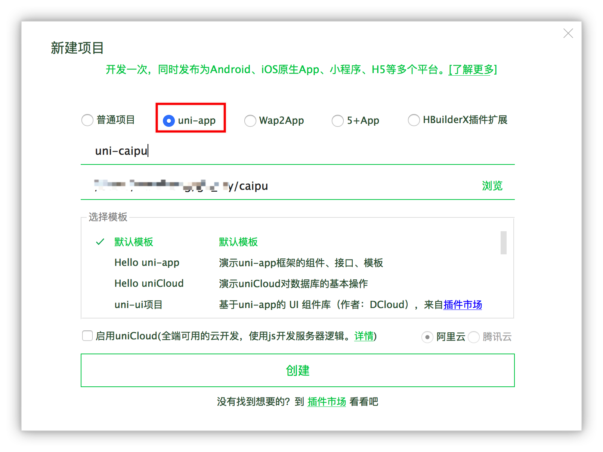
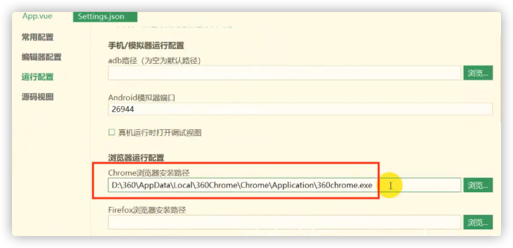
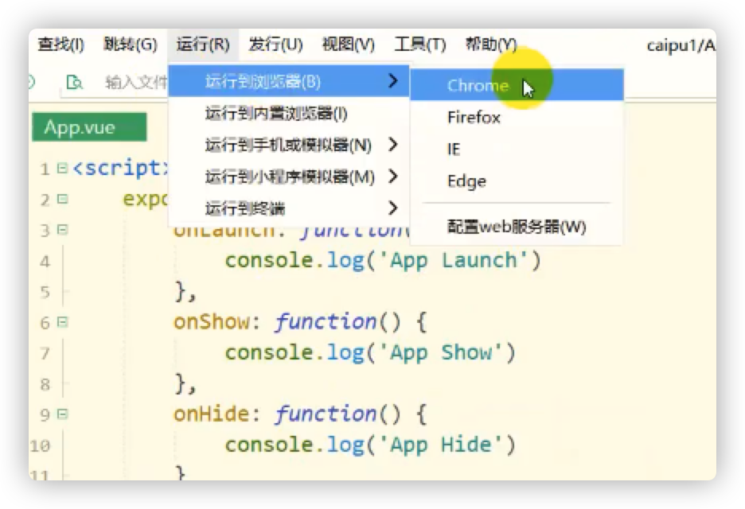
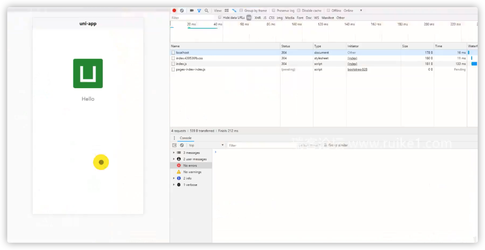
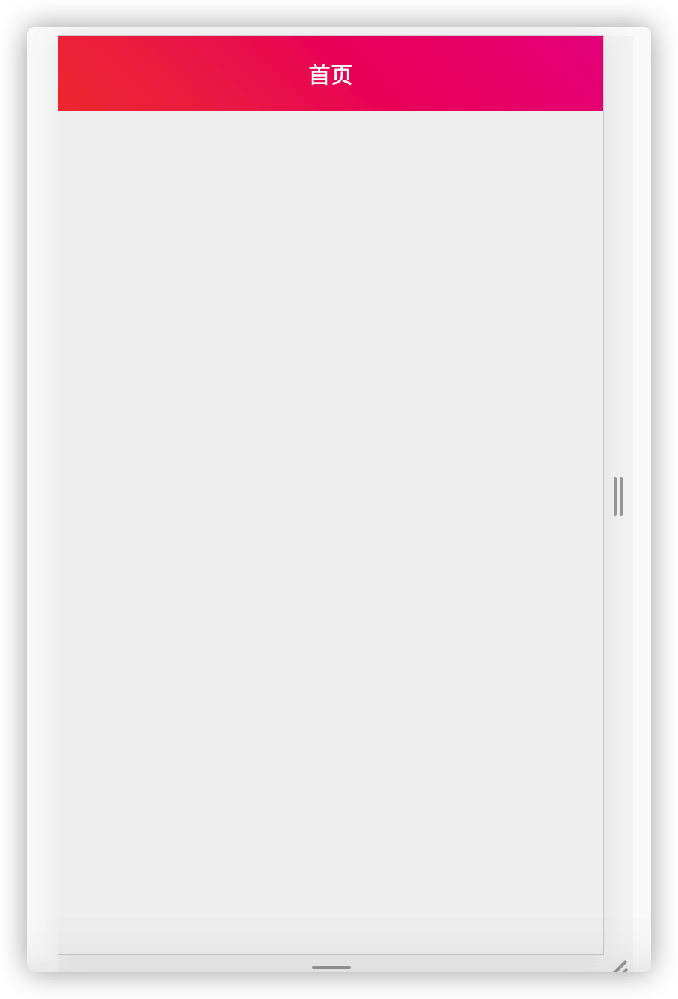

## 创建项目

1. [下载安装Hbuilder](https://www.dcloud.io/hbuilderx.html)
2. 创建一个 uni-app 项目


## 运行

### 1. 配置Chrome浏览器

点击菜单栏 运行 > 运行到浏览器 > 配置web服务器，填写本机上浏览器的安装地址



也可以根据个人喜好配置使用火狐浏览器。

### 2. 运行到浏览器



可看到如下运行效果



## 使用组件库

- [插件市场](https://ext.dcloud.net.cn/)

在组件市场可以查找任意你想要的样式组件，可以找到单个样式的实现，可以找到全套的样式组件，这里我们从侧边栏的下载排行榜里找到一款排名比较靠前的组件库ColorUI，点击进入该插件的主页，点击右侧的**下载该插件zip**, (需要先登录)

[ColorUI-UniApp](https://ext.dcloud.net.cn/plugin?id=239)

在下载页面有使用说明，这里我们再啰嗦一遍

### 1. 开始使用

下载源码解压，复制根目录的 `/colorui` 文件夹到你的根目录

`App.vue` 引入关键Css `main.css`  `icon.css`

```vue
<style>
    @import "colorui/main.css";
    @import "colorui/icon.css";
    ....
</style>
```

### 2. 使用自定义导航栏

导航栏作为常用组件有做简单封装，当然你也可以直接复制代码结构自己修改，达到个性化目的。

`App.vue` 获得系统信息

```js
<script>
  import Vue from 'vue'
  export default {
    onLaunch: function() {
      console.log('App Launch')
      uni.getSystemInfo({
        success: function(e) {
          // #ifndef MP
          Vue.prototype.StatusBar = e.statusBarHeight;
          if (e.platform == 'android') {
            Vue.prototype.CustomBar = e.statusBarHeight + 50;
          } else {
            Vue.prototype.CustomBar = e.statusBarHeight + 45;
          };
          // #endif
          // #ifdef MP-WEIXIN
          Vue.prototype.StatusBar = e.statusBarHeight;
          let custom = wx.getMenuButtonBoundingClientRect();
          Vue.prototype.Custom = custom;
          Vue.prototype.CustomBar = custom.bottom + custom.top - e.statusBarHeight;
          // #endif       
          // #ifdef MP-ALIPAY
          Vue.prototype.StatusBar = e.statusBarHeight;
          Vue.prototype.CustomBar = e.statusBarHeight + e.titleBarHeight;
          // #endif
        }
      })
    },
    onShow: function() {
      console.log('App Show')
    },
    onHide: function() {
      console.log('App Hide')
    }
  }
</script>
```


`pages.json` 配置取消系统导航栏

```json
"globalStyle": {
    "navigationStyle": "custom"
},
```

使用封装,在`main.js` 引入 `cu-custom` 组件。

```js
import cuCustom from './colorui/components/cu-custom.vue'
Vue.component('cu-custom', cuCustom)
```

`page.vue` 页面可以直接调用了

```vue
<template>
  <view class="content">
    <cu-custom bgColor="bg-gradual-red" :isBack="false">
      <block slot="backText">返回</block>
      <block slot="content">首页</block>
    </cu-custom>
  </view>
</template>

<script>
  export default {
    data() {
      return {
        title: 'Hello'
      }
    },
    onLoad() {},
    methods: {}
  }
</script>

<style>
  .content {
    display: flex;
    /* 
    flex-direction: column;
    align-items: center;
    justify-content: center; 
    */
  }

  .logo {
    height: 200rpx;
    width: 200rpx;
    margin-top: 200rpx;
    margin-left: auto;
    margin-right: auto;
    margin-bottom: 50rpx;
  }
</style>
```

现在的运行效果图，仅仅是个导航栏样式而已。

